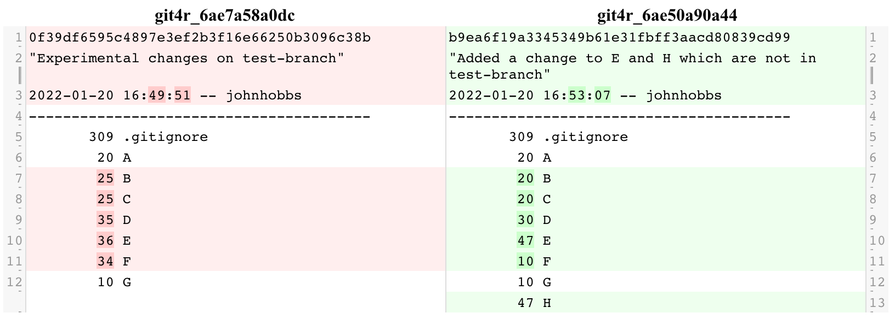
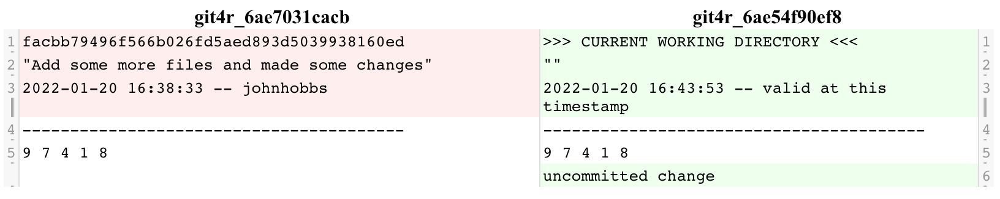
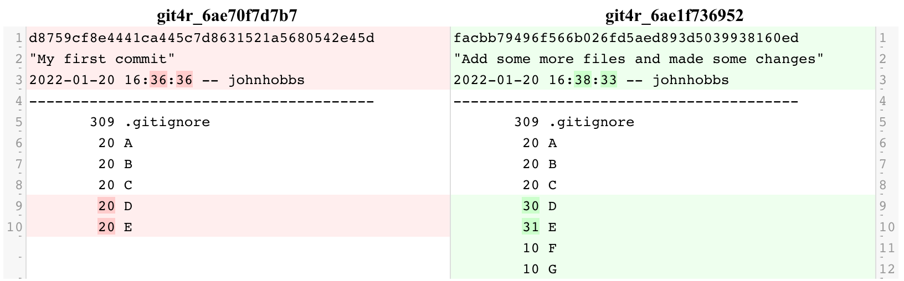
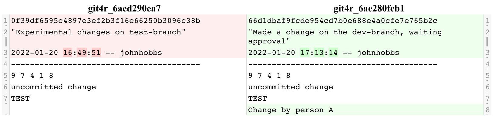

## An introduction to using Git to change-control projects with R

Git is ideal for tracking changes between text-like files, such as code, static
csv lookup tables, your to-do list, etc. Other 'binary' files (like .docx
or .jpeg) can be included too but a hidden copy will be saved every time it
is changed (in `.git/`) which can get quite bloated.
In this demo, we will create a temporary folder of pseudo-code and see how we can
use git to keep parallel versions, view, and restore history.

```
> library(git4r)
Using global (system default) config: johnhobbs <johnhobbs@myemail>
```
```
> myproject = tempfile(pattern = 'test-git-project-')
> dir.create(myproject)
> setwd(myproject)

> # Make some pseudo files for our repository
> for(my_code_files in LETTERS[1:5]) write(sample(letters,10), file=my_code_files)
```

### Selecting files and adding them to a commit

We can create a checkpoint (a *commit*) whenever we want which will save the
contents of any files we choose to *add*. We can then bring back this version of
the file any time in the future, and see the short message describing the change.
Normally we want to add all files to our commit at once (backup everything) 
but you might want to split the changes in two, for example add one file with its
own commit message, and an unrelated change in another.

You will be asked first whether to convert the normal directory to a git
repository -- always make sure you are in the right working directory so
you don't start git-tracking your entire home directory!

```
> git_add()
test-git-project directory is not inside a git repository - check this is the top level else ESCAPE and setwd()
Should this directory be turned into a git repo? (Y/N) Y

Copying default .gitignore to working directory
test-git-project is now a git repo 

Modified files to be added (+ created, - deleted, * changed since added, ? conflict) 
1    +  .gitignore
2    +  A
3    +  B
4    +  C
5    +  D
6    +  E
Which file numbers to add? (Hit ENTER to add all non-conflicting, else ESCAPE) 1 2 3 4

Adding 4 file(s)
```

After adding a couple of files, we will re-run git_add() and see that
we are given the option to remove any we regret. This time we add ALL files by
hitting enter.

```
> git_add()
Changes staged already 
1    +  .gitignore
2    +  A
3    +  B
4    +  C
Any file numbers to un-add? (Hit ENTER to keep all) 

Modified files to be added (+ created, - deleted, * changed since added, ? conflict) 
1    +  D
2    +  E
Which file numbers to add? (Hit ENTER to add all non-conflicting, else ESCAPE) 

Adding 2 file(s)
```

We can now commit all of these changes -- our first checkpoint

```
> git_commit()
Commit message: My first commit

Commit to master? (hit ESCAPE to cancel) 

Done
```

If we now make a whole bunch of changes, we will be able to see the new and
old version of each file, and our helpful commit message which should briefly
describe with one sentence what was changed and why. The 'who' and 'when' are
recorded automatically.

```
> for(even_more_files in LETTERS[4:7]) write(sample(1:10,5), file=even_more_files, append=TRUE)
```
```
> git_add()
Modified files to be added (+ created, - deleted, * changed since added, ? conflict) 
1       D
2       E
3    +  F
4    +  G
Which file numbers to add? (Hit ENTER to add all non-conflicting, else ESCAPE) 

Adding 4 file(s)
```
```
> git_commit()
Commit message: Add some more files and made some changes

Commit to master? (hit ESCAPE to cancel) 

Done
```

### Viewing historic commits

We can view the change history of a folder (always relative to the top directory)
or only changes which change a particular file. This gives us a unique identifier
code for this commit which is a unique hash, as well as timestamp and the message.
```
> git_history()
  1 [facbb79] 2022-01-20: Add some more files and made some changes
  2 [d8759cf] 2022-01-20: My first commit
```
We can look at what has changed between each of these commits using git_diff()
on either a folder or within specific file. We can specify which commit we want to
compare using filters like 'before' or 'message', or use NULL to get the
the version right now. See `?git_history` for the full list.

Here we compare the second most recent commit `n=2` with the most recent `n=1`.
```
> git_diff(path='.', n=2, n=1)
```


The default behaviour is to compare current working directory version with most
recent commit -- showing what will be added (or lost if you `git_undo()`)
```
> write('uncommitted change', 'F', append=TRUE)
```
```
> git_diff(path='F')
```



### Creating and changing branches

An important feature of git is keeping parallel versions of the same working
directory called *branches*, for example if you want to develop some new code
but have a stable working version you can instantly change back to. We can
use `git_branch()` to list the existing branches and change to one of these,
or create a new branch which starts with the current working directory. A 
simplification is made here that forbids changing branch without having committed
all of your changes, because uncommitted changes could get irreversibly lost.

It is good practice to create new branches for each feature or set of changes
you are going to make, and only when it's finished do you merge it back into the
main branch. This is what we shall do here with our 'TEST' change.
```
> git_branch()
Current active branch:  master

New or existing branch name to move to (or hit ENTER to list branches) test-branch

```
```
> for(change_files in LETTERS[2:6]) write('TEST', file=change_files, append=TRUE)
```
```
> git_add()
Modified files to be added (+ created, - deleted, * changed since added, ? conflict) 
1       B
2       C
3       D
4       E
5       F
Which file numbers to add? (Hit ENTER to add all non-conflicting, else ESCAPE) 
```
```
> git_commit()
Commit message: Experimental changes on test-branch

Commit to test-branch? (hit ESCAPE to cancel) 

Done
```
```
> git_branch()
Current active branch:  test-branch

New or existing branch name to move to (or hit ENTER to list branches) 

[facbb7] (Local) master
[0f39df] (Local) (HEAD) test-branch
```


### Merging branches

We can merge these changes back into our master branch, or make another sub-
branch off this one. A common problem that comes up is if you are making
changes on lots of branches, you might change the same file in different ways.
This causes a *conflict* which it will try to resolve automatically, but if
it cannot, it will highlight the code chunk with `<<<<< >>>>>>` and prompt you
to fix it by hand. You will not be allowed to `git_commit()` before you have
confirmed that you have fixed the conflicts and added the files by number.
When a merge is complete, all of the commits from both branches will make up
the shared history.

Return to main branch and write a change to file `E` remembering that we have
already made a conflicting change on test-branch and Git will not know which
is correct.
```
> git_branch()
Current active branch:  test-branch

New or existing branch name to move to (or hit ENTER to list branches) master
```
```
> write('This change will conflict with our test-branch', file='E')
```
```
> write('This change does not conflict with test-branch', file='H')
```
```
> git_add()
Modified files to be added (+ created, - deleted, * changed since added, ? conflict) 
1       E
2    +  H
Which file numbers to add? (Hit ENTER to add all non-conflicting, else ESCAPE) 

Adding 2 file(s)
```
```
> git_commit()
Commit message: Added a change to E and H which are not in test-branch

Commit to master? (hit ESCAPE to cancel) 

Done
```
We can see the difference between the current state of the two branches, these
will be the files which need to merge.
```
git_diff('',branch='test-branch', branch='master')
```

```
> git_merge()
Branch to merge into master: test-branch

Merge test-branch into master 
Proceed? (Y/N) Y

Delete this branch after successful merge? (Y/N) Y

Merging test-branch into master
This merge will result with conflicts to resolve manually. Continue anyway? (Y/N) TRUE
The following files have conflicts:
	E
Deleting branch test-branch
Open the conflicting files and resolve <<<???>>> now? (Y/N) Y

```
This then opens the file in an editor (default RStudio otherwise external) so 
that it can have the conflicting parts deleted. You should do this straight
because the files will appear corrupted with all of the `<<<<` `=====` and `>>>>`
in them.

To make sure you have fixed each file, they will **not** automatically add when
running `git_add()` and each file marked `?` must be added by number.
```
> git_add()
Changes staged already 
1       B
2       C
3       D
4       F
Any file numbers to un-add? (Hit ENTER to keep all) 

Modified files to be added (+ created, - deleted, * changed since added, ? conflict) 
1    ?  E
Which file numbers to add? (Hit ENTER to add all non-conflicting, else ESCAPE) 1

Adding 1 file(s)
```
```
> git_commit()
Commit message: Completed the merge of our test code

Commit to master? (hit ESCAPE to cancel) 

Done
```
The history of the main branch now contains all commits from both branches, and 
another commit we did immediately after completing the merge.
```
> git_history()
  1 [a92c7d2] 2022-01-20: Completed the merge of our test code
  2 [b9ea6f1] 2022-01-20: Added a change to E and H which are not in test-branch
  3 [0f39df6] 2022-01-20: Experimental changes on test-branch
  4 [facbb79] 2022-01-20: Add some more files and made some changes
  5 [d8759cf] 2022-01-20: My first commit
```


### Reverting back to a previous commit

Occasionally things will go wrong with our code and we will want to hard reset
or we merge / delete a branch by mistake. This is totally *undo*-able as long as
it is done as soon as possible. 

`git_undo()` will show the recent history of actions that have happened locally
(Git's *reflog*) and allow you to restore the working directory to a previous 
commit checkpoint. It does not remember what branch you were on, so you may
have to `git_branch()` to the branch with the right name before restoring the
old files.

Typical use is to wipe any changes since the last commit by resetting to the
zero commit on the list. It will duly warn of the irreversibly loss (which can
be checked with `git_diff()`).
```
> file.remove('B', 'D', 'G')
[1] TRUE TRUE TRUE
```
```
> git_undo()

Not all changes have been committed! Run git_diff() to see what.

>>>>> Continuing will result in IRREVERSIBLE LOSS <<<<<

0  [a92c7d2] HEAD@{0}: commit (merge): Completed the merge of our test code
1  [b9ea6f1] HEAD@{1}: commit: Added a change to E and H which are not in test-branch
2  [facbb79] HEAD@{2}: checkout: moving from test-branch to master
3  [0f39df6] HEAD@{3}: commit: Experimental changes on test-branch
4  [facbb79] HEAD@{4}: checkout: moving from master to test-branch
5  [facbb79] HEAD@{5}: commit: Add some more files and made some changes
6  [d8759cf] HEAD@{6}: commit (initial): My first commit
Which commit to reset to? (Hit ESCAPE to cancel) 0

Selected: [a92c7d2] HEAD@{0}: commit (merge): Completed the merge of our test code
Confirm that you really want to change the working directory to historic state? (Y/N) Y

```
Happy days.
```
> list.files()
[1] "A" "B" "C" "D" "E" "F" "G" "H"
```


## Setting up a remote copy on a shared drive

Git repositories can be synchronised with a shared location to allow multiple
people to make versions (branches), commit changes and provide backup.

In your team, choose a shared drive which has the access level you need, and
make a directory. Use this as the `GIT_DEFAULT_REMOTE` by adding this to your
.Renviron file (see `?git_remote` for example).

Here we will use a pretend temporary `default_remote` folder
```
> demo_default_remote = tempfile(pattern = 'test-default-remote-')
> dir.create(demo_default_remote)
> Sys.setenv(GIT_DEFAULT_REMOTE = demo_default_remote)
```

### Adding a new remote

Repositories can be given a 'remote' copy which allows changes to pushed to it
and then others can then pull (download) these changes to their own local
version. This remote is often an http server such as GitHub however this may
not be reachable using a corporate system or not wanted.

This package encourages a simple shared drive folder to keep remote copies of the
team's code which can then be synchronised internally.

Remote copies can have different names (such as 'public-mirror') and you can
choose which branches they should contain. However, **only** the remote called
'origin' will be used to pull (download) changes from and this is usually the
only remote you will have. 

Here we will add the default origin which means saving a copy in the 
`GIT_DEFAULT_REMOTE` folder path.
```
> git_remote()
Path to repo to modify remotes? (Hit ENTER for current repo) 

Listing remotes for the remote / repo "."
No remote yet!
Add remote? Specify with name='/path/or/url' or hit ENTER to add default origin or ESCAPE 

Now run git_push() to complete setup of remote branches
Creating bare repo at /tmp/test-default-remote/test-git-project
Adding origin at /tmp/test-default-remote/test-git-project
```
```
> git_push()
Current branch is not yet pushed to origin -- do this manually
Available remotes
1    origin  /tmp/test-default-remote/test-git-project
Index number of remote to push to: 1

Local branches to push (+ if not in remote, > current branch) 
1    +  >  master
Which branch numbers to push? (Hit ENTER to add all except + else ESCAPE) 1

Done
```
```
> git_pull()
Pull result: Already up-to-date
```

### Pushing changes to remote

After making commits to a branch, this branch should be pushed to the remote.
A branch can be kept local (private) by not pushing this branch. It is bad
practice to commit to the main branch because this will almost certainly give
problems where two people change the same file. Best is to create a unique
(and helpful) named branch and a nominated 'repository owner' does a merge into
the main branch for everyone. (This is often called a merge request or 
pull-request and can be strictly enforced on http remotes).

The cycle of pull-add-commit-push has been wrapped up in a simple `git()` call.
```
> git_branch()
Current active branch:  master

New or existing branch name to move to (or hit ENTER to list branches) dev-branch
```
```
write('Change by person A', file='F', append=TRUE)
```
```
> git()
Skipping pull: active branch has not been pushed to origin remote
Modified files to be added (+ created, - deleted, * changed since added, ? conflict) 
1       F
Which file numbers to add? (Hit ENTER to add all non-conflicting, else ESCAPE) 

Adding 1 file(s)
Commit message: Made a change on the dev-branch, waiting approval

Commit to dev-branch? (hit ESCAPE to cancel) 

Done
Current branch is not yet pushed to origin -- do this manually
Available remotes
1    origin  /tmp/test-default-remote/test-git-project
Index number of remote to push to: 1

Local branches to push (+ if not in remote, > current branch) 
1    +  >  dev-branch
2          master
Which branch numbers to push? (Hit ENTER to add all except + else ESCAPE) 1 2

Done
```


### Cloning another copy from the shared remote

Sharing code is made simple by cloning the remote folder to make a local copy.
This automatically sets the same 'origin' remote as where you cloned from which 
means all changes are kept in sync even after cloning (every time you *pull*). 
Here, the `GIT_DEFAULT_REMOTE` folder is used to list all repos which have been
pushed there and can be cloned from, or you can give another path or http address.
Changing to a remote branch will create a local copy.

If two people do push different commits onto the same branch, when you next
pull (download changes) it will give conflicts like a merge and `git_add()`
should be used to find and fix the conflicting files.
```
> git_clone()
Available repo names: 
test-git-project
```
We can see the project that someone previously pushed, which we can download
another downstream copy of.
```
> another_tempdir = tempfile()
> dir.create(another_tempdir)
> git_clone('test-git-project', to=another_tempdir)
Cloning  test-git-project  into " /tmp/another_tempdir/test-git-project "
 -- proceed? (Y/N) Y

Cloning to /tmp/another_tempdir/test-git-project
Set working directory to here? (Y/N) Y
```
If we look at what branches exist, we can see it has created a local copy of the
main branch, and if we change to 'dev-branch' it will do likewise (if we want to
create our own new branch, we must choose a totally unique name).
```
> git_branch()
Current active branch:  master

New or existing branch name to move to (or hit ENTER to list branches) 

[a92c7d] (Local) (HEAD) master
[66d1db] (origin @ /tmp/test-default-remote/test-git-project) dev-branch
(origin @ /tmp/test-default-remote/test-git-project) HEAD
[a92c7d] (origin @ /tmp/test-default-remote/test-git-project) master
New or existing branch name to move to (or hit ENTER to cancel) 
```
We can inspect and merge remote branches in the same way as if they were local.
Here we do a typical repository maintenance job of approving somebody elses 
changes and making them part of the main branch.
```
git_diff('F', branch='master', branch='origin/dev-branch')
```

```
> git_merge()
Branch to merge into master: origin/dev-branch

Merge origin/dev-branch into master 
Proceed? (Y/N) Y

Delete this branch after successful merge? (Y/N) N

Merging origin/dev-branch into master
```

